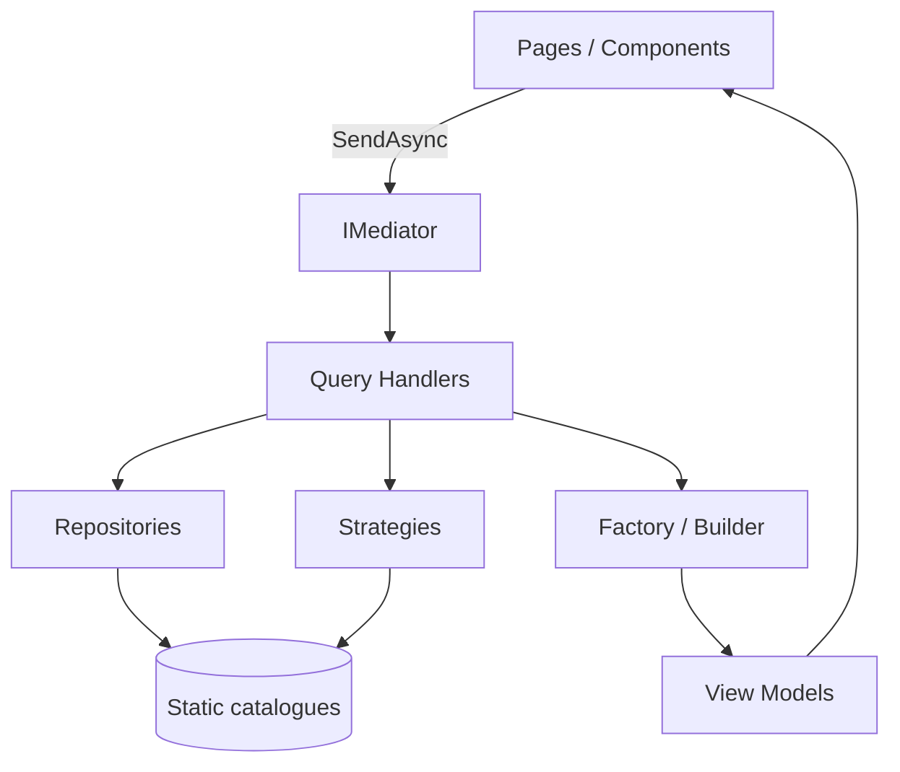

# Portfolio .NET — Blazor Static Rendering

[](https://dotnet.microsoft.com/)
[](https://learn.microsoft.com/aspnet/core/blazor/)
[](.github/workflows/deploy-pages.yml)
[](LICENSE)

Portfolio profesional de un desarrollador .NET Senior, construido como
**vitrina de ingeniería**: arquitectura limpia, patrones documentados, calidad
verificada por el build y despliegue 100% estático en GitHub Pages.

## Visión general

- **Producto**: sitio de presentación con Home, About, Skills, Projects,
  Architecture y Contact.
- **Demostración**: cada patrón aplicado tiene su documento y su enlace desde la
  página `/architecture`.
- **Restricción autoimpuesta**: cero JavaScript en el sitio final. Blazor Web
  App con *static SSR* y un exportador propio produce HTML plano.

## Stack

| Área | Tecnología |
| --- | --- |
| Runtime | .NET 10, ASP.NET Core, Blazor Web App (static rendering) |
| UI | Razor Components, CSS moderno (custom properties, `color-mix`, scroll animations) |
| Idiomas | Español (raíz) e inglés (`/en`) con rutas estáticas, sin JavaScript |
| Arquitectura | Clean Architecture ligera, CQRS con mediator propio |
| DevOps | GitHub Actions, GitHub Pages, exportador estático |
| Calidad | Nullable, `TreatWarningsAsErrors`, EditorConfig, Options validadas |

## Arquitectura



Detalle completo en
[`src/Portfolio.Web/Documentation/architecture.md`](src/Portfolio.Web/Documentation/architecture.md).

## Estructura

```
.
├── .github/workflows/deploy-pages.yml   # CI/CD a GitHub Pages
├── src/Portfolio.Web/
│   ├── Components/                      # App, Routes, Shared, Sections
│   ├── Layouts/                         # MainLayout, NavMenu, Footer
│   ├── Pages/                           # Rutas del sitio
│   ├── Features/                        # Queries + handlers (casos de uso)
│   ├── Models/                          # Dominio + ViewModels
│   ├── Services/                        # Abstracciones, repos, patrones, opciones, localización
│   ├── Resources/                       # Catálogos resx ES (neutral) y EN
│   ├── Shared/                          # NavigationCatalog
│   ├── Documentation/                   # Patrones y componentes
│   └── wwwroot/                         # Themes (CSS), Assets (SVG)
├── tools/Portfolio.StaticExporter/      # Exportador HTML estático
├── scripts/                             # Export local (PowerShell y bash)
├── Directory.Build.props                # Calidad global
├── .editorconfig
└── Portfolio.slnx
```

## Patrones implementados

| Patrón | Implementación | Documento |
| --- | --- | --- |
| Dependency Injection | `AddPortfolio` como composition root | [link](src/Portfolio.Web/Documentation/dependency-injection.md) |
| Options | `PortfolioOptions` validado al arranque | [link](src/Portfolio.Web/Documentation/options.md) |
| Repository | `IProjectRepository` + 4 repositorios más | [link](src/Portfolio.Web/Documentation/repository.md) |
| Strategy | Badges por categoría y filtros de proyectos | [link](src/Portfolio.Web/Documentation/strategy.md) |
| Factory | `ProjectCardFactory` | [link](src/Portfolio.Web/Documentation/factory.md) |
| Builder | `PortfolioSectionBuilder` fluido | [link](src/Portfolio.Web/Documentation/builder.md) |
| Mediator (light) | `PortfolioMediator` sin dependencias | [link](src/Portfolio.Web/Documentation/mediator.md) |
| Static Rendering | `Portfolio.StaticExporter` + workflow | [link](src/Portfolio.Web/Documentation/static-rendering.md) |

Componentes reutilizables documentados en
[`Documentation/components`](src/Portfolio.Web/Documentation/components/README.md).

## Ejecución local

Requisitos: [.NET SDK 10](https://dotnet.microsoft.com/download).

```bash
dotnet restore
dotnet build -c Release
dotnet run --project src/Portfolio.Web
```

La aplicación queda disponible en `https://localhost:xxxx` (perfil HTTPS) o
`http://localhost:xxxx` (perfil HTTP).

## Export estático y publicación

El workflow [`.github/workflows/deploy-pages.yml`](.github/workflows/deploy-pages.yml)
hace todo el proceso: publica la app, la arranca, descubre las rutas vía
`sitemap.xml`, exporta HTML y despliega en Pages. El sub-path se calcula solo:
`/` para repos `usuario.github.io` y `/<repo>/` para el resto.

Para reproducirlo en local:

```powershell
# PowerShell
./scripts/export-static.ps1 -BasePath /mi-repo/ -PublicUrl https://usuario.github.io
```

```bash
# bash
BASE_PATH=/mi-repo/ PUBLIC_URL=https://usuario.github.io ./scripts/export-static.sh
```

El resultado queda en `dist/` (ignorado por git) con `index.html`, una carpeta
por ruta, `404.html`, `sitemap.xml`, `robots.txt` y `.nojekyll`.

## Personalización

Todo el contenido del perfil vive en `src/Portfolio.Web/appsettings.json`
(sección `Portfolio`): nombre, rol, tagline, email, LinkedIn, GitHub,
experiencia, disponibilidad y `BasePath`. Los campos de texto son bilingües
(`{ "Es": "...", "En": "..." }`). Los datos de proyectos, skills, timeline y
patrones son catálogos estáticos en `src/Portfolio.Web/Services/Repositories`,
también con textos `LocalizedText`.

> Antes de publicar, sustituye `PublicBaseUrl`, `Email` y los perfiles sociales
> de ejemplo por los tuyos.

## Idiomas

El sitio es bilingüe y completamente estático: **el idioma vive en la URL**, sin
JavaScript, cookies ni `localStorage`.

| Idioma | URLs | Página |
| --- | --- | --- |
| Español (por defecto) | `/es`, `/es/about`, `/es/projects`, ... | `/es/` |
| Inglés | `/en`, `/en/about`, `/en/projects`, ... | `/en/` |

La raíz (`/`) es una página de redirección a `/es/`, para que la cultura esté
siempre presente en la ruta.

- El conmutador del header es un enlace que conserva la query string
  (`/projects?category=Mobile` → `/en/projects?category=Mobile`).
- Cada página declara sus dos rutas (`@page "/es/projects"` y
  `@page "/en/projects"`) y añade `canonical` + `hreflang` en el `<head>`.
- Los textos de interfaz viven en `src/Portfolio.Web/Resources`
  (`SharedResource.resx` = español, `SharedResource.en.resx` = inglés) y se
  consumen con `Localizer["Clave"]`.
- Los datos de dominio usan `LocalizedText(Es, En)` y se resuelven en handlers y
  factorías según `ILanguageContext`.

Detalle y reglas para añadir contenido:
[`localization.md`](src/Portfolio.Web/Documentation/localization.md).

## Decisiones técnicas

| Decisión | Motivo |
| --- | --- |
| Static SSR sin `blazor.web.js` | Hosting estático puro, SEO perfecto y cero JS. |
| Mediator propio | Desacoplar casos de uso sin dependencias externas. |
| Datos tras repositorios | Migrar a CMS/API sin tocar la UI. |
| CSS propio con `pf-` | Sin frameworks pesados; theming con variables. |
| Exportador en `tools/` | Responsabilidad única, testeable y reutilizable. |
| `UsePathBase` + `<base>` | Un solo código para raíz y sub-path de Pages. |
| Traductor propio (`ITranslator`) | Idioma desde la URL, sin cultura ambiente ni satélites: mismo resultado en runtime y export. |

## Calidad

- `Nullable` e `ImplicitUsings` activados.
- `TreatWarningsAsErrors=true`: la build falla con una advertencia.
- `EnforceCodeStyleInBuild` + `.editorconfig` (IDE0005 entre otras).
- XML docs y documentación por patrón/componente.
- Accesibilidad AA: foco visible, landmarks, contraste, `prefers-reduced-motion`.
- Rendimiento: HTML estático, sin fuentes externas ni JS; animaciones con CSS.

Resultado de la revisión arquitectónica completa:
[`architecture-review.md`](src/Portfolio.Web/Documentation/architecture-review.md).

## Escalabilidad

El diseño deja preparadas, sin implementarlas (YAGNI), estas ampliaciones:

- **Blog**: nueva feature + repositorio, sin tocar las existentes.
- **API/CMS**: implementar `IProjectRepository` contra el origen real.
- **Idiomas**: implementado ES/EN por rutas estáticas
  ([`localization.md`](src/Portfolio.Web/Documentation/localization.md)); añadir
  un tercer idioma es crear el resx, las rutas y la entrada de navegación.
- **Analytics**: `PageVisitedNotification` ya se publica en cada página.
- **Interactividad puntual**: añadir `@rendermode InteractiveServer` a un
  componente y desplegar en un host .NET, manteniendo la arquitectura.

## Licencia

MIT. Consulta [LICENSE](LICENSE).
