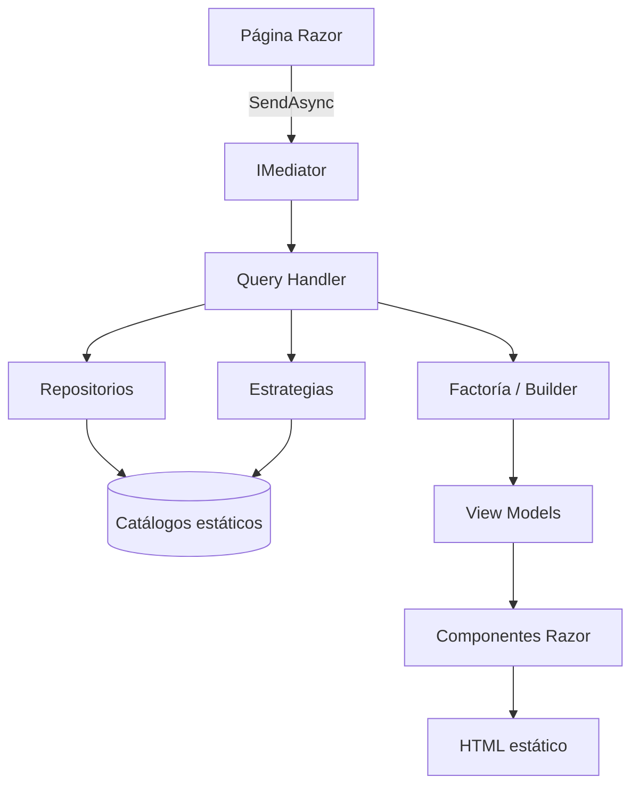

# Arquitectura del portfolio

## Visión general

Aplicación Blazor Web App (.NET 10) con renderizado estático en servidor,
organizada en capas con dependencias dirigidas hacia el núcleo. El sitio es a
la vez producto (portfolio) y demostración (arquitectura, patrones, calidad).

## Flujo de una petición



## Capas

| Capa | Carpeta | Responsabilidad |
| --- | --- | --- |
| Presentación | `Components/`, `Layouts/`, `Pages/` | Pintar HTML; cero reglas de negocio. |
| Aplicación | `Features/`, `Services/Mediator/` | Casos de uso como queries y handlers. |
| Dominio de apoyo | `Services/Strategies`, `Factories`, `Builders`, `Models/` | Reglas de composición y proyección. |
| Infraestructura | `Services/Repositories`, `Services/Options` | Origen de datos y configuración. |

## Estructura de carpetas

```
src/Portfolio.Web/
├── Components/          # App, Routes, Shared, Sections
├── Layouts/             # MainLayout, NavMenu, Footer
├── Pages/               # Rutas (/ , /about, /skills, /projects, ...)
├── Features/            # Queries + handlers por caso de uso
├── Models/              # Dominio + ViewModels
├── Services/            # Abstracciones, repositorios, patrones, opciones
├── Shared/              # Catálogo de navegación
├── Documentation/       # Esta documentación
└── wwwroot/             # Themes (CSS), Assets (SVG), favicon
tools/Portfolio.StaticExporter/   # Exportador a HTML estático
```

## Decisiones clave

1. **Static SSR sin JavaScript**: compatibilidad total con GitHub Pages y
   rendimiento máximo. Ver `static-rendering.md`.
2. **Mediator propio**: desacopla páginas de casos de uso sin dependencias
   externas. Ver `mediator.md`.
3. **Datos estáticos tras repositorios**: el contenido se migrará a un CMS o
   API sin tocar la UI. Ver `repository.md`.
4. **Configuración validada**: `PortfolioOptions` falla al arrancar si falta
   cualquier dato. Ver `options.md`.
5. **Documentación como código**: cada patrón tiene su archivo y la página
   `/architecture` enlaza directamente a estos documentos.

## Patrones aplicados

| Patrón | Documento | Implementación principal |
| --- | --- | --- |
| Dependency Injection | [dependency-injection.md](dependency-injection.md) | `PortfolioServiceCollectionExtensions` |
| Options | [options.md](options.md) | `PortfolioOptions` |
| Repository | [repository.md](repository.md) | `IProjectRepository` y familia |
| Strategy | [strategy.md](strategy.md) | `ITechnologyBadgeStrategy`, `IProjectFilterStrategy` |
| Factory | [factory.md](factory.md) | `ProjectCardFactory` |
| Builder | [builder.md](builder.md) | `PortfolioSectionBuilder` |
| Mediator | [mediator.md](mediator.md) | `PortfolioMediator` |
| Static Rendering | [static-rendering.md](static-rendering.md) | `Portfolio.StaticExporter` |

## Principios

- **SOLID** verificado en `architecture-review.md`.
- **DRY**: navegación única (`NavigationCatalog`), view models por proyección.
- **KISS**: sin librerías UI, sin JavaScript, sin ORM para datos estáticos.
- **YAGNI**: extensiones futuras documentadas, no implementadas.
- **Separation of Concerns**: una responsabilidad por clase y por componente.
