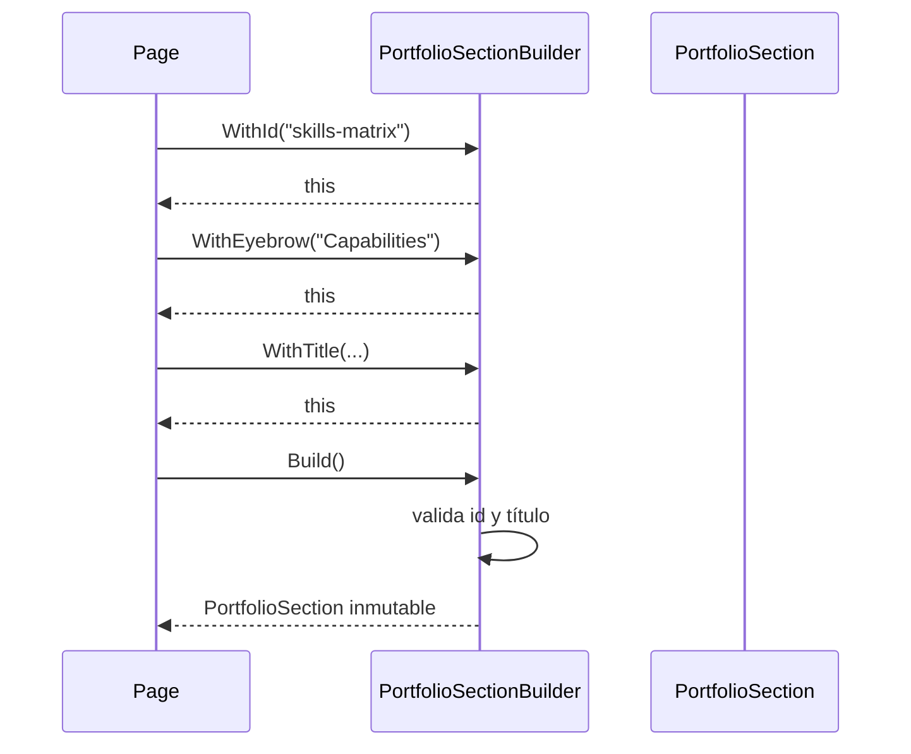

# Builder Pattern

## Qué es

El patrón Builder construye objetos complejos paso a paso, separando el proceso
de composición de la representación final. Se expresa con una API fluida que se
lee casi como una frase.

## Por qué se usa

Cada página necesita cabeceras de sección con la misma forma (id, eyebrow,
título, subtítulo, clase CSS). Repetir esas tuplas en el marcado es propenso a
errores y difícil de evolucionar. `PortfolioSectionBuilder` convierte esa
composición en código explícito y validado.

## Ventajas

- **DRY**: una única definición de "sección" para toda la web.
- Legibilidad: la composición se lee de arriba abajo.
- Validación al construir: `Build()` falla si falta el título o el id.
- Inmutable al final: el resultado es un `record` de solo lectura.

## Implementación en este proyecto

```csharp
timelineSection = SectionBuilder
    .WithId("timeline-list")
    .WithEyebrow("Career")
    .WithTitle("Experience, education and certifications")
    .WithSubtitle("The short version of a path that started with algorithms...")
    .Build();
```

```csharp
public PortfolioSection Build()
{
    if (string.IsNullOrWhiteSpace(_id))
        throw new InvalidOperationException("A section requires an identifier.");
    if (string.IsNullOrWhiteSpace(_title))
        throw new InvalidOperationException($"Section '{_id}' requires a title.");

    return new PortfolioSection(_id, _eyebrow, _title, _subtitle, _cssClass);
}
```

Se registra como **transient** para que cada consumidor componga su propia
sección sin estado compartido.

## Diagrama


