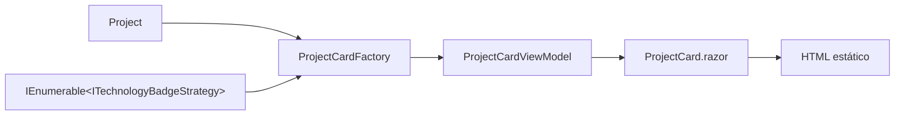

# Factory Pattern

## Qué es

El patrón Factory centraliza la creación (o proyección) de objetos complejos:
el consumidor pide un producto listo para usar y no conoce los pasos
intermedios.

## Por qué se usa

Los componentes de UI deben ser declarativos. Si `ProjectCard` tuviera que
mapear estados, categorías, colores y badges, dejaría de ser reutilizable y
comenzaría a acumular reglas de negocio.

`ProjectCardFactory` concentra esa proyección:

```
Project (dominio) ──► ProjectCardFactory ──► ProjectCardViewModel (UI)
```

## Ventajas

- **Single Responsibility**: la proyección vive en un único lugar.
- Componentes simples: reciben un view model y lo pintan.
- La composición de badges delega en la familia de estrategias.
- Facilita pruebas de mapeo sin renderizar componentes.

## Implementación en este proyecto

```csharp
public sealed class ProjectCardFactory(
    IEnumerable<ITechnologyBadgeStrategy> badgeStrategies) : IProjectCardFactory
{
    public ProjectCardViewModel Create(Project project)
    {
        var badges = project.Technologies.Select(CreateBadge).ToArray();
        var (statusLabel, statusCssClass) = MapStatus(project.Status);

        return new ProjectCardViewModel(
            project.Id, project.Title, /* ... */, badges,
            project.RepositoryUrl, project.LiveUrl);
    }
}
```

Observa la colaboración entre patrones: la factory **no** conoce las reglas de
pintado de cada categoría; se las pide a las estrategias.

## Diagrama



## Casos de uso

- Tarjetas destacadas en la home (`GetFeaturedProjectsQuery`).
- Catálogo completo o filtrado en `/projects`.
- Cualquier futura vista que necesite el mismo contrato (búsqueda, favoritos).
