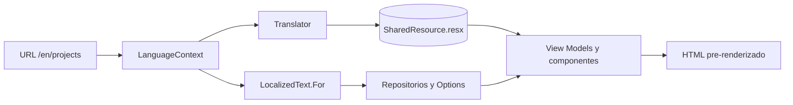

# Localización (ES/EN)

## Decisión

El sitio es **bilingüe y 100% estático**: el idioma vive en la URL, no en una
cookie ni en `localStorage`. Eso permite pre-renderizar ambos idiomas, indexarlos
por separado y no depender de JavaScript.

| Idioma | URLs |
| --- | --- |
| Español (por defecto) | `/es`, `/es/about`, `/es/skills`, `/es/projects`, `/es/architecture`, `/es/contact` |
| Inglés | `/en`, `/en/about`, `/en/skills`, `/en/projects`, `/en/architecture`, `/en/contact` |

La raíz (`/`) es una página estática de redirección a `/es/`, de modo que la
cultura aparece siempre en la ruta y ambas versiones son simétricas.

El botón del header (`LanguageSwitcher`) es un enlace `<a>` a la misma página en
el otro idioma. Conserva la query string, así que un filtro como
`/es/projects?category=Mobile` cambia a `/en/projects?category=Mobile`.

## Componentes de la solución

| Pieza | Responsabilidad |
| --- | --- |
| `Language` / `LocalizedText` | Modelo del idioma y contenido bilingüe del dominio. |
| `ILanguageContext` / `LanguageContext` | Deduce el idioma desde el prefijo `en` de la URL y construye hrefs conscientes del idioma. |
| `ITranslator` / `Translator` | Resuelve las cadenas de UI desde los catálogos embebidos según el idioma actual. |
| `LocalizedProfile` | `PortfolioOptions` con sus textos ya resueltos para la petición. |
| `SharedResource.resx` / `SharedResource.en.resx` | Catálogos de cadenas de interfaz (neutral = español, `.en` = inglés). |

## Por qué un traductor propio y no `IStringLocalizer`

Se probó el camino estándar (`AddLocalization` + satélites). El satélite inglés
no se resolvía de forma fiable (`NeutralResourcesLanguage`, convención de
manifiestos y `AssemblyLoadContext`), y el resultado dependía de la cultura
ambiente del hilo.

`Translator` elimina esa clase de fallos:

```csharp
private static readonly ResourceManager Spanish =
    new("Portfolio.Web.Resources.SharedResource", typeof(SharedResource).Assembly);

private static readonly ResourceManager English =
    new("Portfolio.Web.Resources.SharedResource.en", typeof(SharedResource).Assembly);

private ResourceManager GetResourceManager() =>
    language.Language == Language.En ? English : Spanish;
```

Ambos `.resx` se embeben en el ensamblado principal con `LogicalName` explícito
(ver `Portfolio.Web.csproj`), sin satélites y sin mutar `CultureInfo`. La misma
lógica funciona en ejecución y durante el export estático.

## Flujo de render



## Reglas para añadir contenido

1. **Texto de interfaz**: nueva entrada en `SharedResource.resx` (español) y
   `SharedResource.en.resx` (inglés), con la misma clave. Se consume con
   `Localizer["Clave"]`.
2. **Datos de dominio** (proyectos, experiencia, skills, patrones, perfil): usar
   `LocalizedText` y resolver con `ILanguageContext`; los view models siguen
   conteniendo `string`.
3. **Enlaces internos**: siempre `LanguageContext.BuildHref("ruta")`, nunca un
   `href` fijo.
4. **Páginas nuevas**: declarar las dos rutas (`@page "/es/ruta"` y
   `@page "/en/ruta"`) y añadir el elemento a `NavigationCatalog`.

## SEO

- `<html lang>` dinámico por página.
- `canonical` por idioma y `rel="alternate" hreflang="es|en|x-default"`.
- `sitemap.xml` con 13 URLs (raíz + 6 ES + 6 EN).
- El `404.html` se sirve en español: GitHub Pages solo admite una página 404.

## Limitaciones asumidas

- Sin detección automática del idioma del navegador (requeriría JavaScript).
- Sin persistencia de preferencia: el idioma es parte de la URL.
- Los meses del timeline usan formato invariante (`Sep 2025`) para que el export
  sea determinista; la palabra "Actualidad/Present" sí se traduce.
