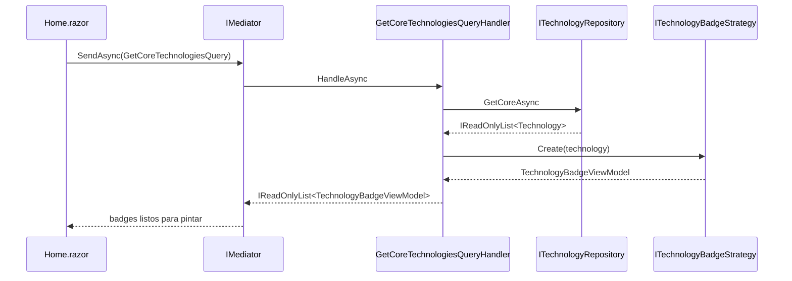

# Mediator (Light)

## Qué es

El patrón Mediator interpone un objeto que coordina la comunicación entre
componentes, de modo que estos no se referencian entre sí. En su variante
"light" para aplicaciones .NET, las páginas envían *requests* y publican
*notifications*; los *handlers* registrados en DI los procesan.

## Por qué se usa

Sin mediador, cada página terminaría inyectando repositorios, estrategias y
factorías, conociendo detalles de implementación de cada caso de uso. Con el
mediador, una página expresa **intención**:

```csharp
var projects = await Mediator.SendAsync(new GetProjectsQuery(category));
```

## Ventajas

- Desacopla presentación de orquestación.
- Un handler por caso de uso: fácil de localizar, probar y cachear.
- Las *notifications* permiten añadir analítica/cross-cutting sin tocar páginas.
- Cero dependencias externas: implementación propia de ~60 líneas.

## Implementación en este proyecto

Contratos mínimos:

```csharp
public interface IRequest<out TResponse> { }

public interface IRequestHandler<in TRequest, TResponse>
    where TRequest : IRequest<TResponse>
{
    Task<TResponse> HandleAsync(TRequest request, CancellationToken ct = default);
}
```

El mediador resuelve el handler por reflexión y desenvuelve las excepciones con
`ExceptionDispatchInfo` para no perder el stack original:

```csharp
var handlerType = typeof(IRequestHandler<,>)
    .MakeGenericType(request.GetType(), typeof(TResponse));
var handler = serviceProvider.GetService(handlerType)
    ?? throw new InvalidOperationException($"No handler registered for '{request.GetType().Name}'.");
```

Además soporta múltiples `INotificationHandler<T>` por notificación
(`PublishAsync`). Hoy `PageVisitedNotification` se registra en el log;
mañana podría alimentar un contador de visitas estático.

## Diagrama



## Regla de oro

Una página nunca referencia un repositorio directamente. Si necesitas datos,
existe (o se crea) un request y su handler.
