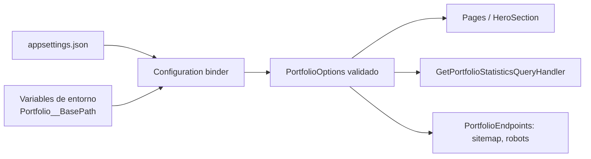

# Options Pattern

## Qué es

El patrón Options enlaza una sección de configuración (`appsettings.json`,
variables de entorno, secretos…) con un objeto fuertemente tipado, validado y
validado al arranque.

## Por qué se usa

- Evita cadenas mágicas (`configuration["Portfolio:Email"]`) repartidas por el código.
- Centraliza y tipa los datos personales del portfolio.
- Falla rápido: si la configuración es inválida, la aplicación no arranca.
- Habilita IntelliSense y refactors seguros.

## Ventajas

| Ventaja | Detalle |
| --- | --- |
| Tipado fuerte | `PortfolioOptions` es la única fuente de verdad. |
| Validación temprana | `ValidateDataAnnotations()` + `ValidateOnStart()`. |
| Parametrización total | Nada del perfil está *hardcodeado* en los componentes. |
| Overrides por entorno | Variables como `Portfolio__BasePath` cambian el despliegue. |

## Implementación en este proyecto

`PortfolioOptions` declara anotaciones de datos y una propiedad calculada que
normaliza el sub-path de GitHub Pages:

```csharp
public sealed class PortfolioOptions
{
    public const string SectionName = "Portfolio";

    [Required, EmailAddress] public string Email { get; set; } = string.Empty;
    [Required, Url] public string GitHubUrl { get; set; } = string.Empty;
    public string BasePath { get; set; } = "/";

    public string NormalizedBasePath => /* "/" o "/segmento/" */;
}
```

La validación ocurrió de verdad durante el desarrollo: al ejecutar el binario
desde un directorio sin `appsettings.json`, la aplicación se detuvo con
`OptionsValidationException` en lugar de renderizar datos vacíos.

## Diagrama


