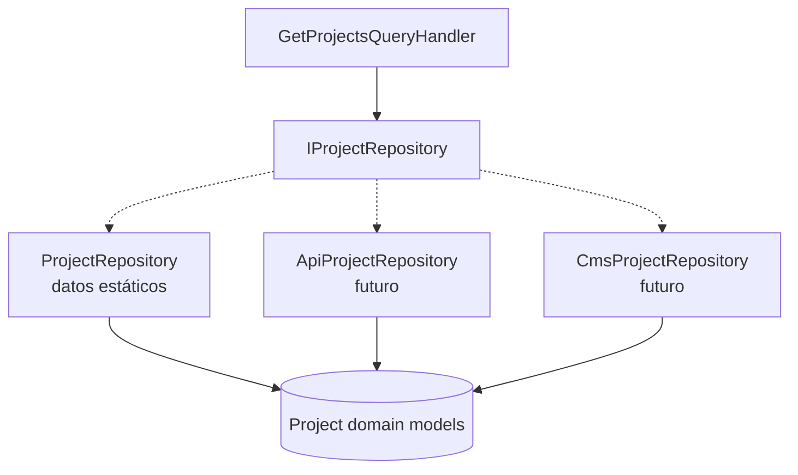

# Repository Pattern

## Qué es

El patrón Repository encapsula el acceso a datos detrás de una abstracción con
semántica de dominio. El resto de la aplicación pide **entidades**, nunca filas,
archivos o endpoints.

## Por qué se usa

- Aísla la fuente de datos: hoy catálogos estáticos, mañana un CMS o una API.
- Permite probar los casos de uso sin infraestructura real.
- Mantiene las consultas en un solo lugar por agregado.

## Ventajas

| Ventaja | Impacto |
| --- | --- |
| Sustituibilidad | Cambiar de datos estáticos a API no toca componentes ni handlers. |
| Testabilidad | Los handlers se prueban con dobles en memoria. |
| Contratos estables | Las firmas sobreviven a los cambios de almacenamiento. |
| Separación de capas | La capa de presentación desconoce de dónde vienen los datos. |

## Implementación en este proyecto

Cuatro repositorios pequeños, cada uno con una única responsabilidad:

```csharp
public interface IProjectRepository
{
    Task<IReadOnlyList<Project>> GetAllAsync(CancellationToken cancellationToken = default);
    Task<Project?> GetByIdAsync(string id, CancellationToken cancellationToken = default);
}
```

`ProjectRepository`, `SkillRepository`, `ExperienceRepository`,
`TechnologyRepository` y `ArchitecturePatternRepository` devuelven datos
inmutables (`IReadOnlyList<T>`), por lo que se registran como **singleton**.
`GetByIdAsync` ya existe aunque hoy no se use desde la UI: es parte natural del
contrato y evita romperlo en la futura página de detalle (YAGNI pragmático en
abstracciones, KISS en el consumo).

## Diagrama



Las implementaciones futuras se añaden sin modificar al consumidor: solo cambia
la línea de registro en el contenedor.
