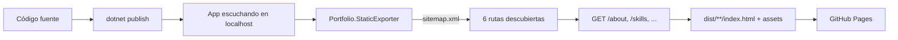

# Static Rendering

## Qué es

Blazor Web App con **renderizado estático en servidor (static SSR)**: cada
petición produce HTML completo en el servidor. No hay circuito interactivo, no
se descarga `blazor.web.js` y la página funciona sin JavaScript.

## Por qué se usa

GitHub Pages solo sirve archivos estáticos. En lugar de renunciar a Blazor,
el sitio se pre-renderiza ruta por ruta durante la integración continua y se
publica como HTML plano.

## Ventajas

| Ventaja | Consecuencia |
| --- | --- |
| Cero JavaScript | Lighthouse y accesibilidad sin ruido. |
| SEO completo | Cada URL es HTML real y cacheable. |
| Coste cero de hosting | GitHub Pages sirve archivos estáticos. |
| Fallos imposibles en cliente | No hay hidratación que pueda romper la página. |

## Cómo funciona en este proyecto

1. `Program.cs` aplica `UsePathBase` con `PortfolioOptions.NormalizedBasePath`,
   de modo que la app funciona igual en `/` que en `/mi-repo/`.
2. `<base href="@basePath" />` y enlaces relativos (`href="projects"`) hacen que
   la navegación resuelva correctamente en cualquier sub-path.
3. El exportador lee `sitemap.xml`, visita cada ruta, copia `wwwroot` (sin
   `_framework` ni precomprimidos) y genera `404.html`, `robots.txt`,
   `sitemap.xml` y `.nojekyll`.

## Detalles que marcan la diferencia

- **Sin script de Blazor**: el `<script src="_framework/blazor.web.js">` se
  eliminó a propósito. La navegación es HTML puro y funciona en cualquier host.
- **Errores 404**: GitHub Pages sirve `404.html`, generado desde la propia
  página `NotFound` de Blazor.
- **Rutas filtradas**: `/projects?category=Mobile` es una URL real y
  pre-renderizable porque el filtro vive en la query string.

## Limitaciones asumidas

- No hay interactividad en cliente (por decisión de diseño).
- Los formularios post no existen; el contacto usa `mailto:` y enlaces.

## Escalabilidad

Si en el futuro se necesita interactividad puntual, basta con añadir
`@rendermode InteractiveServer` a un componente y desplegar en un host .NET. La
arquitectura (mediator, repositorios, estrategias) no cambia.
