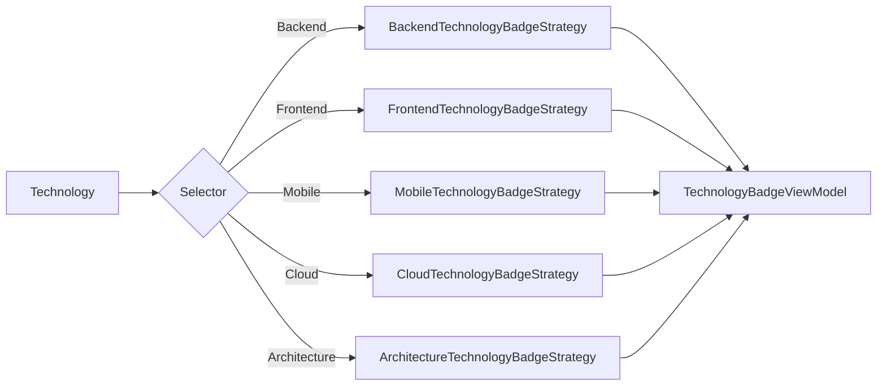

# Strategy Pattern

## Qué es

El patrón Strategy define una familia de algoritmos intercambiables, encapsula
cada uno y permite seleccionarlo en tiempo de ejecución sin condicionales en el
consumidor.

## Por qué se usa

En este proyecto hay dos familias con el mismo problema de fondo: decidir
"cómo" según una categoría.

1. `ITechnologyBadgeStrategy` — cómo se pinta un badge para cada
   `TechnologyCategory` (Backend, Frontend, Mobile, Cloud, Architecture).
2. `IProjectFilterStrategy` — cómo se filtra el catálogo según la categoría
   solicitada por query string.

## Ventajas

- **Open/Closed**: añadir una categoría es añadir una clase y una línea de DI.
- Elimina `switch`/`if` crecientes en UI y handlers.
- Cada estrategia es testeable de forma aislada.
- El registro en el contenedor hace visible el catálogo completo de opciones.

## Implementación en este proyecto

Una base reutiliza la lógica común y las concretas solo declaran su categoría:

```csharp
public abstract class TechnologyBadgeStrategyBase : ITechnologyBadgeStrategy
{
    protected abstract TechnologyCategory Category { get; }
    protected abstract string Label { get; }
    protected abstract string CssClass { get; }

    public bool CanHandle(TechnologyCategory category) => category == Category;

    public TechnologyBadgeViewModel Create(Technology technology) => new(
        technology.Name, Label, CssClass, technology.Icon, technology.Accent,
        $"{technology.Name}, {Label}");
}
```

La selección se hace por composición, no por `switch`:

```csharp
var strategy = badgeStrategies.First(s => s.CanHandle(technology.Category));
```

El filtro de proyectos funciona igual pero desde el handler,
con `CanHandle(ProjectCategory?)` donde `null` significa "sin filtro".

## Diagrama


